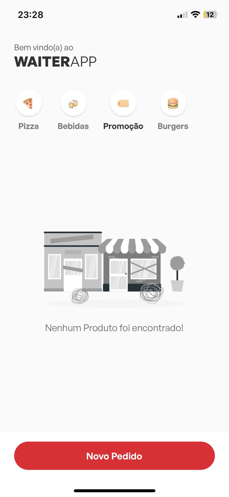
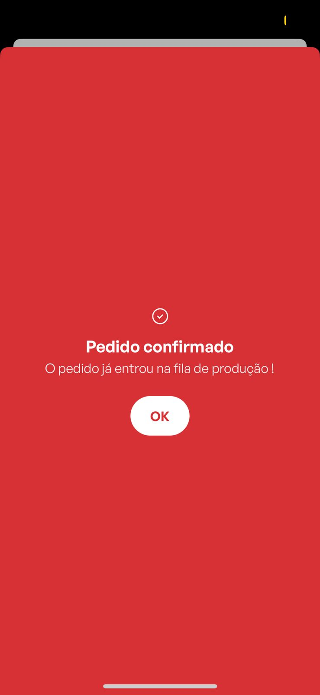

# Waiterapp 

Aplicativo que o intuito é o garçom fazer os pedidos para que sejam vistos da cozinha e ter uma melhor perfomance no seu restaurante.

# Tecnologias Utilizadas 

- React Native
- Javascript
- Typescript
- Styled-Components
- Axios

# Layout

<div className="div">
  
  
  
  
</div>

# Como rodar o projeto 

Abra seu terminal em uma pasta de sua preferência e execute os comandos abaixos em ordem: 

```
$ git clone https://github.com/zkauansantos/waiterAPP.git

$ cd waiterAPP

$ yarn

$ yarn start 

```
* A partir daqui se você não possuir o android studio em seu computador baixe o aplicativo abaixo conforme o seu dispositivo :

  <a href="https://apps.apple.com/br/app/expo-go/id982107779" target="_blank">
    Expo Go - IOS
  </a>

  <a href="https://play.google.com/store/apps/details?id=host.exp.exponent&hl=pt_BR&gl=US&pli=1" target="_blank">
    Expo Go - Android
  </a>

- Para visualizar as imagens em seu dispositivo você terá que trocar os endpoints conforme o Expo go indicar assim que você inicializar o projeto troque o IP que está nesse projeto para o IP de sua máquina.

- Logo após instalado quando você executar o comando "yarn start" o seu terminal irá abrir um QRcode, com isso basta apenas ler o code com a câmera do seu celular e ver rodando em seu dispositivo, lembrando que precisa ter a API rodando em sua máquina: 

- <a href="https://github.com/zkauansantos/waiterappAPI.git">Link API</a>